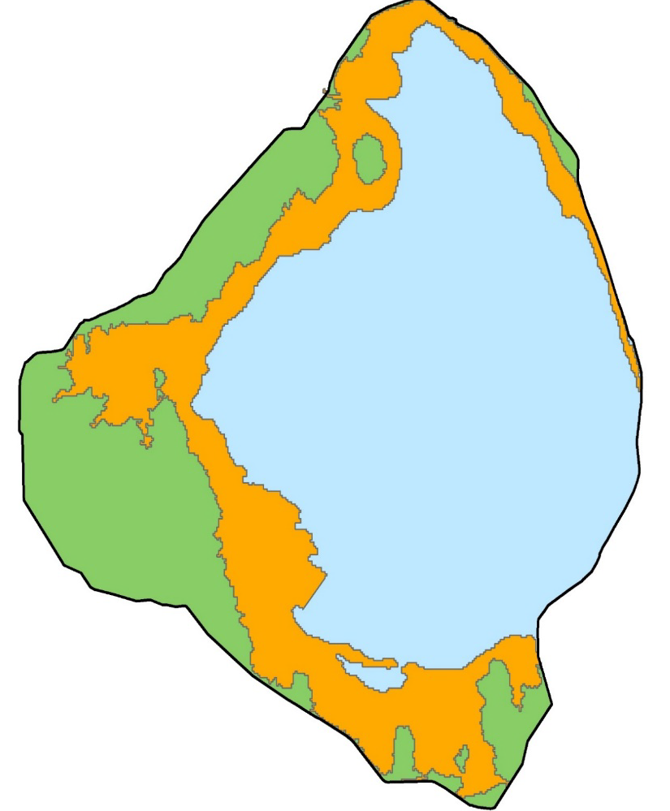

```{r setup, include=FALSE,echo=FALSE}
knitr::opts_chunk$set(echo = TRUE)
knitr::opts_chunk$set(
  collapse = TRUE,
  comment = "#>",
  fig.path = "man/figures/README-"
)
```

# LORECOVER 

[](https://zenodo.org/badge/latestdoi/349568854)

## Table of Contents

* [Introduction](#intro)
* [Citing package](#cite)
* [Installation](#install)

## Introduction <a name="intro"></a>
Functions in this package calculate normal and recovery stage envelopes for Lake Okeechobee. Complete documentation for this performance measure can be found on the [USACE](https://usace.contentdm.oclc.org/utils/getfile/collection/p16021coll7/id/14096) webpage. 

```{r,message=F,warning=F,echo=F,fig.align="center",fig.width=6.5,fig.height=3.5,dpi=120,fig.cap="Generalized normal (left) and recovery (right) stage envelope scores."}
library(AnalystHelper)
library(lubridate)
library(zoo)
library(LORECOVER)

dates.val=seq(date.fun("2016-01-01"),date.fun("2017-01-01"),"1 months")[1:12] +(diff(seq(date.fun("2016-01-01"),date.fun("2017-01-01"),"1 months"))/2)[1:11]
gen.score=data.frame(expand.grid(Date=date.fun(dates.val),Data.Value=seq(8,19,0.25)))
gen.score=subset(gen.score,!(Data.Value%in%seq(8,19,0.5)))
norm.gen.scr=norm_env(gen.score)
rec.gen.scr=rec_env(gen.score)


norm.stage.scr=data.frame(norm.stage.score)
norm.stage.scr2=norm.stage.scr
norm.stage.scr$Date=with(norm.stage.scr,date.fun(paste(2016,month,day,sep="-")))
norm.stage.scr2$Date=with(norm.stage.scr,date.fun(paste(2017,month,day,sep="-")))
norm.stage.scr=rbind(norm.stage.scr,norm.stage.scr2)
norm.stage.scr$Low22=with(norm.stage.scr,ifelse(is.na(LP2.5)==T,LP3,LP2))
norm.stage.scr$CY=as.numeric(format(norm.stage.scr$Date,"%Y"))

rec.stage.scr=data.frame(rec.stage.score)
rec.stage.scr2=rec.stage.scr
rec.stage.scr$Date=with(rec.stage.scr,date.fun(paste(2016,month,day,sep="-")))
rec.stage.scr2$Date=with(rec.stage.scr,date.fun(paste(2017,month,day,sep="-")))
rec.stage.scr=rbind(rec.stage.scr,rec.stage.scr2)
rec.stage.scr$LP22=with(norm.stage.score,ifelse(is.na(LP2.5)==T,LP3,LP2))
rec.stage.scr$CY=as.numeric(format(rec.stage.scr$Date,"%Y"))

xlim.val=date.fun(c("2016-01-01","2017-01-01"));xmaj=seq(xlim.val[1],xlim.val[2],"3 months");xmin=seq(xlim.val[1],xlim.val[2],"1 months")
ylim.val=c(8,19);by.y=2;ymaj=seq(ylim.val[1],ylim.val[2],by.y);ymin=seq(ylim.val[1],ylim.val[2],by.y/2)

par(family="serif",mar=c(1,1,0.25,1),oma=c(2.5,3.75,1,0.25));
layout(matrix(1:2,1,2,byrow=T))

plot(LP1~Date,norm.stage.scr,ylim=ylim.val,xlim=xlim.val,ann=F,axes=F,type="n",xaxs="i",yaxs="i")
abline(h=seq(8,19,0.5),v=xmin,col="grey")
with(subset(norm.stage.scr,is.na(Date)==F),shaded.range(Date,LP0.5,UP0.5,"grey50",lty=1,col="black"))
with(norm.gen.scr,text(Date,Data.Value,round(penalty),cex=0.5,col="dodgerblue1"))
axis_fun(1,xmaj,xmin,format(xmaj,"%d-%b"),cex=0.8,line=-0.5)
axis_fun(2,ymaj,ymin,format(ymaj));box(lwd=1)
mtext(side=2,line=2.5,"Stage Elevation (Ft, NGVD29)")
mtext(side=3,adj=0,"Normal Envelope")
mtext(side=1,line=2,"Date (Day-Month)")

plot(LP1~Date,rec.stage.scr,ylim=ylim.val,xlim=xlim.val,ann=F,axes=F,type="n",xaxs="i",yaxs="i")
abline(h=seq(8,19,0.5),v=xmin,col="grey")
with(subset(rec.stage.scr,is.na(Date)==F),shaded.range(Date,LP0.5,UP0.5,"grey50",lty=1,col="black"))
# with(rec.stage.scr,shaded.range(Date,Up05_1,Upper,"grey80",lty=1,col="black"))
# with(rec.stage.scr,shaded.range(Date,Up05_1,Up1_2,"grey50",lty=1,col="black"))
# with(rec.stage.scr,shaded.range(Date,Up1_2,rep(20,length(Date)),"grey50",lty=1,col="black"))
# with(rec.stage.scr,shaded.range(Date,Low1_15,Low,"grey80",lty=1,col="black"))
# with(rec.stage.scr,shaded.range(Date,Low15_2,Low1_15,"grey80",lty=1,col="black"))
# with(subset(rec.stage.scr,is.na(Low2_25)==F),shaded.range(Date,Low2_25,Low15_2,"grey80",lty=1,col="black"))
# with(subset(rec.stage.scr,is.na(Low2_3)==F),shaded.range(Date,Low2_3,Low15_2,"grey50",lty=1,col="black"))
# with(rec.stage.scr,shaded.range(Date,rep(7,length(Date)),Low2,"grey50",lty=1,col="black"))
with(rec.gen.scr,text(Date,Data.Value,round(penalty),cex=0.5,col="indianred1"))
axis_fun(1,xmaj,xmin,format(xmaj,"%d-%b"),cex=0.8,line=-0.5)
axis_fun(2,ymaj,ymin,NA);box(lwd=1)
mtext(side=3,adj=1,"Recovery Envelope")
mtext(side=1,line=2,"Date (Day-Month)")
```

***

```{r,message=F}
library(AnalystHelper)
library(lubridate)
library(LORECOVER)

# Data from SFWMD
dat=DBHYDRO_daily(date.fun("2016-01-01"),date.fun("2021-12-31"),15611)
dat$CY=as.numeric(format(dat$Date,"%Y"))

```

#### Normal Lake Stage Envelope

```{r}
#Normal Envelope
norm=subset(dat,CY==2016)
norm.val=norm_env(norm)
```

```{r,echo=F,fig.align="center",fig.width=5,fig.height=4.5,dpi=120,fig.cap="The Normal lake stage envelope and approximate corresponding scores that apply for lake stages outside the desired range. Scores are actually applied by the hundredths of a foot on a daily basis and may not correspond exactly to the boxes shown. For reference and as an example, 2016 stages are overlaid onto the envelope and corresponding scores are shown in the lower panel."}

norm.stage.scr=data.frame(norm.stage.score)
norm.stage.scr2=norm.stage.scr
norm.stage.scr$Date=with(norm.stage.scr,date.fun(paste(2016,month,day,sep="-")))

norm.stage.scr2$Date=with(norm.stage.scr,date.fun(paste(2017,month,day,sep="-")))
norm.stage.scr=rbind(norm.stage.scr,norm.stage.scr2)
# norm.stage.scr$Low2=with(norm.stage.scr,ifelse(is.na(Low2_25)==T,Low2_3,Low2_25))
norm.stage.scr$CY=as.numeric(format(norm.stage.scr$Date,"%Y"))

xlim.val=date.fun(c("2016-01-01","2017-01-01"));xmaj=seq(xlim.val[1],xlim.val[2],"3 months");xmin=seq(xlim.val[1],xlim.val[2],"1 months")
ylim.val=c(8,19);by.y=2;ymaj=seq(ylim.val[1],ylim.val[2],by.y);ymin=seq(ylim.val[1],ylim.val[2],by.y/2)

par(family="serif",mar=c(1,0.75,0.25,1),oma=c(2.5,3.75,1,0.25));
layout(matrix(1:2,2,1,byrow=T),heights=c(1,0.5))

plot(LP1~Date,norm.stage.scr,ylim=ylim.val,xlim=xlim.val,ann=F,axes=F,type="n",xaxs="i",yaxs="i")
abline(h=ymaj,v=xmaj,lty=3,col="grey")
with(subset(norm.stage.scr,is.na(Date)==F),shaded.range(Date,LP0.5,UP0.5,"grey50",lty=1,col="black"))
with(norm,lines(Date,Data.Value,col=adjustcolor("dodgerblue1",0.5),lwd=3))
axis_fun(1,xmaj,xmin,NA)
axis_fun(2,ymaj,ymin,format(ymaj));box(lwd=1)
mtext(side=2,line=2.5,"Stage Elevation (Ft, NGVD29)")
mtext(side=3,adj=0,"2016")

ylim.val=c(0,6);by.y=2;ymaj=seq(ylim.val[1],ylim.val[2],by.y);ymin=seq(ylim.val[1],ylim.val[2],by.y/2)
plot(penalty~Date,norm.val,ylim=ylim.val,xlim=xlim.val,ann=F,axes=F,type="n",xaxs="i",yaxs="i")
abline(h=ymaj,v=xmaj,lty=3,col="grey")
with(norm.val,shaded.range(Date,rep(0,length(Date)),abs(penalty),"dodgerblue1",lty=1))
axis_fun(1,xmaj,xmin,format(xmaj,"%d-%b"))
axis_fun(2,ymaj,ymin,format(ymaj));box(lwd=1)
mtext(side=2,line=2.5,"abs(Daily Score)")
mtext(side=1,line=2,"Date (Day-Month)")

```

#### Recovery Lake Stage Envelope

```{r}
#Recovery Envelope
rec=subset(dat,CY==2019)
rec.val=rec_env(rec)

```

```{r,echo=F,fig.align="center",fig.width=5,fig.height=4.5,dpi=120,fig.cap="The Recovery lake stage envelope and approximate corresponding scores that apply for lake stages outside the desired range. Scores are actually applied by the hundredths of a foot on a daily basis and may not correspond exactly to the boxes shown. For reference and as an example, 2019 stages are overlaid onto the envelope and corresponding scores are shown in the lower panel."}

rec.stage.scr=data.frame(rec.stage.score)
rec.stage.scr2=rec.stage.scr
rec.stage.scr$Date=with(rec.stage.scr,date.fun(paste(2019,month,day,sep="-")))
rec.stage.scr2$Date=with(rec.stage.scr,date.fun(paste(2020,month,day,sep="-")))
rec.stage.scr=rbind(rec.stage.scr,rec.stage.scr2)

# rec.stage.scr$Low2=with(norm.stage.score,ifelse(is.na(Low2_25)==T,Low2_3,Low2_25))

xlim.val=date.fun(c("2019-01-01","2020-01-01"));xmaj=seq(xlim.val[1],xlim.val[2],"3 months");xmin=seq(xlim.val[1],xlim.val[2],"1 months")
ylim.val=c(8,19);by.y=2;ymaj=seq(ylim.val[1],ylim.val[2],by.y);ymin=seq(ylim.val[1],ylim.val[2],by.y/2)

par(family="serif",mar=c(1,0.75,0.25,1),oma=c(2.5,3.75,1,0.25));
layout(matrix(1:2,2,1,byrow=T),heights=c(1,0.5))


plot(LP1~Date,norm.stage.scr,ylim=ylim.val,xlim=xlim.val,ann=F,axes=F,type="n",xaxs="i",yaxs="i")
abline(h=ymaj,v=xmaj,lty=3,col="grey")
with(subset(rec.stage.scr,is.na(Date)==F),shaded.range(Date,LP0.5,UP0.5,"grey50",lty=1,col="black"))
with(rec,lines(Date,Data.Value,col=adjustcolor("indianred1",0.5),lwd=3))
axis_fun(1,xmaj,xmin,NA)
axis_fun(2,ymaj,ymin,format(ymaj));box(lwd=1)
mtext(side=2,line=2.5,"Stage Elevation (Ft, NGVD29)")
mtext(side=3,adj=0,"2019")

ylim.val=c(0,6);by.y=2;ymaj=seq(ylim.val[1],ylim.val[2],by.y);ymin=seq(ylim.val[1],ylim.val[2],by.y/2)
plot(penalty~Date,rec.val,ylim=ylim.val,xlim=xlim.val,ann=F,axes=F,type="n",xaxs="i",yaxs="i")
abline(h=ymaj,v=xmaj,lty=3,col="grey")
with(rec.val,shaded.range(Date,rep(0,length(Date)),abs(penalty),"indianred1",lty=1))
axis_fun(1,xmaj,xmin,format(xmaj,"%d-%b"))
axis_fun(2,ymaj,ymin,format(ymaj));box(lwd=1)
mtext(side=2,line=2.5,"abs(Daily Score)")
mtext(side=1,line=2,"Date (Day-Month)")

```

## Citing package <a name="cite"></a>

```{r}
citation('LORECOVER')
```


## Installation <a name="install"></a>

Development version can be installed from this repo. 

```{r,eval=F}
install.packages("devtools");# if you do not have it installed on your PC
devtools::install_github("SwampThingPaul/LORECOVER")
```


***
