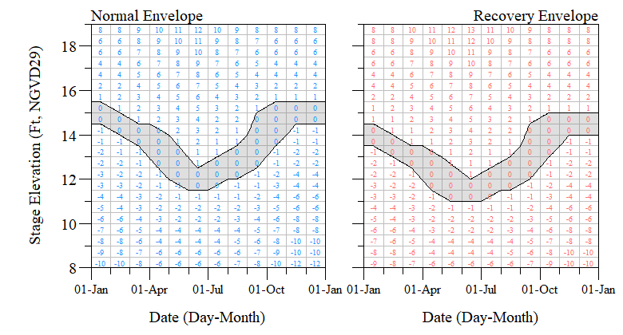
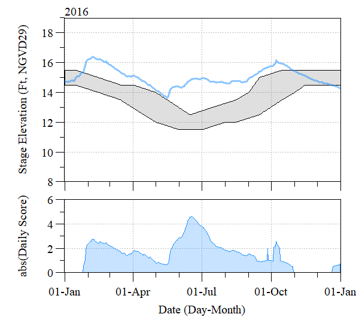
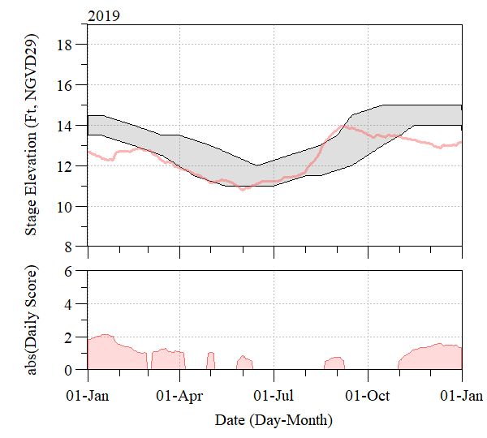

Untitled
================

# LORECOVER 

[](https://zenodo.org/badge/latestdoi/349568854)

## Table of Contents

-   [Introduction](#intro)
-   [Citing package](#cite)
-   [Installation](#install)

## Introduction <a name="intro"></a>

Functions in this package calculate normal and recovery stage envelopes
for Lake Okeechobee. Complete documentation for this performance measure
can be found on the
[USACE](https://usace.contentdm.oclc.org/utils/getfile/collection/p16021coll7/id/14096)
webpage.

<div class="figure" style="text-align: center">


<p class="caption">
Generalized normal (left) and recovery (right) stage envelope scores.
</p>

</div>

------------------------------------------------------------------------

``` r
library(AnalystHelper)
library(lubridate)
library(LORECOVER)

# Data from SFWMD
dat=DBHYDRO_daily(date.fun("2016-01-01"),date.fun("2021-12-31"),15611)
dat$CY=as.numeric(format(dat$Date,"%Y"))
```

#### Normal Lake Stage Envelope

``` r
#Normal Envelope
norm=subset(dat,CY==2016)
norm.val=norm_env(norm)
```

<div class="figure" style="text-align: center">


<p class="caption">
The Normal lake stage envelope and approximate corresponding scores that
apply for lake stages outside the desired range. Scores are actually
applied by the hundredths of a foot on a daily basis and may not
correspond exactly to the boxes shown. For reference and as an example,
2016 stages are overlaid onto the envelope and corresponding scores are
shown in the lower panel.
</p>

</div>

#### Recovery Lake Stage Envelope

``` r
#Recovery Envelope
rec=subset(dat,CY==2019)
rec.val=rec_env(rec)
```

<div class="figure" style="text-align: center">


<p class="caption">
The Recovery lake stage envelope and approximate corresponding scores
that apply for lake stages outside the desired range. Scores are
actually applied by the hundredths of a foot on a daily basis and may
not correspond exactly to the boxes shown. For reference and as an
example, 2019 stages are overlaid onto the envelope and corresponding
scores are shown in the lower panel.
</p>

</div>

## Citing package <a name="cite"></a>

``` r
citation('LORECOVER')
#> 
#> To cite package 'LORECOVER' in publications use:
#> 
#>   Paul Julian (2021). LORECOVER: Lake Okeechobee Stage Envelope
#>   Performance Measure Calculation. R package version 0.2.2.
#>   https://github.com/SwampThingPaul/LORECOVER
#> 
#> A BibTeX entry for LaTeX users is
#> 
#>   @Manual{,
#>     title = {LORECOVER: Lake Okeechobee Stage Envelope Performance Measure Calculation},
#>     author = {Paul Julian},
#>     year = {2021},
#>     note = {R package version 0.2.2},
#>     url = {https://github.com/SwampThingPaul/LORECOVER},
#>   }
```

## Installation <a name="install"></a>

Development version can be installed from this repo.

``` r
install.packages("devtools");# if you do not have it installed on your PC
devtools::install_github("SwampThingPaul/LORECOVER")
```

------------------------------------------------------------------------
